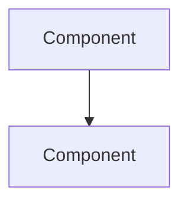

# Agent Prompts Reference

Task templates for spawning subagents in worktrees.

## Code Review Agent (Security)

```
Task: Perform security-focused code review

Focus areas:
- Injection vulnerabilities (SQL, command, XSS)
- Authentication/authorization flaws
- Sensitive data exposure
- Insecure configurations
- Cryptographic weaknesses

Process:
1. Search for user input handling (Grep for: input, param, request, body)
2. Check authentication/authorization patterns
3. Review data validation/sanitization
4. Identify secrets/credentials in code
5. Check dependency vulnerabilities

Output format (findings.md):
# Security Review Findings

## Critical
- [FILE:LINE] Description of vulnerability

## High
- [FILE:LINE] Description

## Medium
- [FILE:LINE] Description

## Recommendations
1. Actionable recommendation

## Files Reviewed
- src/auth/*.py
- src/api/*.py
```

## Code Review Agent (Performance)

```
Task: Perform performance-focused code review

Focus areas:
- Memory leaks and unbounded growth
- N+1 query patterns
- Inefficient algorithms (O(n²) or worse)
- Unnecessary allocations
- Blocking I/O in async code
- Resource cleanup issues

Process:
1. Profile hot paths (Grep for: loop, for, while, map, filter)
2. Check database query patterns
3. Review async/await usage
4. Identify large allocations
5. Check resource cleanup (context managers, finally blocks)

Output format (findings.md):
# Performance Review Findings

## High Impact
- [FILE:LINE] Description + estimated impact

## Medium Impact
- [FILE:LINE] Description

## Low Impact
- [FILE:LINE] Description

## Optimizations Applied
1. [FILE:LINE] Change made

## Benchmarks (if applicable)
- Before: X ms
- After: Y ms
```

## Architecture Agent (Plan)

```
Task: Analyze codebase architecture and provide recommendations

Focus areas:
- Design patterns and consistency
- Modularity and coupling
- Scalability concerns
- Code organization
- Dependency management
- Extension points

Process:
1. Map directory structure and module organization
2. Identify core abstractions
3. Analyze dependency graph
4. Review interface contracts
5. Identify technical debt

Output format (architecture_review.md):
# Architecture Review

## Current State
- Module count: X
- Key abstractions: A, B, C
- Dependency depth: N

## Strengths
1. What's working well

## Concerns
1. Architectural issues identified

## Recommendations
1. Actionable improvements

## Proposed Refactoring (if applicable)
- Phase 1: Description
- Phase 2: Description

## Diagrams (Mermaid)


```

## SDK Verifier Agent

```

Task: Verify Claude Agent SDK compliance

For Python projects:

- Check pyproject.toml has claude-agent-sdk dependency
- Verify hook implementations (PreToolUse, PostToolUse, etc.)
- Check session management patterns
- Verify MCP server configurations
- Check for proper async/await usage

For TypeScript projects:

- Check package.json has @anthropic-ai/claude-code-sdk
- Verify hook exports
- Check session lifecycle
- Verify MCP configurations

Output format (sdk_compliance.md):

# SDK Compliance Report

## Dependencies

- [x] claude-agent-sdk: X.Y.Z
- [ ] Missing: dependency

## Hooks

- [x] PreToolUse: implemented
- [ ] PostToolUse: missing

## Session Management

- [x] connect() called once
- [x] disconnect() on cleanup
- [ ] interrupt() not implemented

## MCP Servers

- [x] Configured: server1, server2
- [ ] Missing configuration

## Recommendations

1. Add missing hooks
2. Implement interrupt() for cancellation

## PASS/FAIL: [RESULT]

```

## Testing Agent

```

Task: Analyze test coverage and identify gaps

Focus areas:

- Coverage gaps in critical paths
- Missing edge case tests
- Flaky test identification
- Test organization
- Mock/stub quality

Process:

1. Run coverage report (pytest --cov or npm test -- --coverage)
2. Identify uncovered lines/branches
3. Review test quality (assertions, edge cases)
4. Check for flaky tests (timing, external dependencies)
5. Review mock patterns

Output format (test_report.md):

# Test Coverage Report

## Coverage Summary

- Lines: X%
- Branches: Y%
- Functions: Z%

## Critical Gaps

- [FILE:LINE] Uncovered critical path

## Recommended Tests

1. Test case for [scenario]

## Flaky Tests Identified

- test_file.py::test_name (reason)

## Test Quality Issues

- [FILE] Missing edge cases

## New Tests Added

- test_file.py::test_new_function

```

## Spawning Pattern (Task Tool)

```typescript
// Parallel spawning pattern
const agents = [
    {
        subagent_type: 'general-purpose',
        name: 'review-security',
        prompt: securityReviewPrompt,
        model: 'sonnet'
    },
    {
        subagent_type: 'general-purpose',
        name: 'review-performance',
        prompt: performanceReviewPrompt,
        model: 'sonnet'
    },
    {
        subagent_type: 'Plan',
        name: 'architecture',
        prompt: architecturePrompt,
        model: 'opus'
    },
    {
        subagent_type: 'agent-sdk-dev:agent-sdk-verifier-py',
        name: 'sdk-verify',
        prompt: sdkVerifyPrompt,
        model: 'haiku'
    },
    {
        subagent_type: 'test-runner',
        name: 'testing',
        prompt: testingPrompt,
        model: 'haiku'
    }
];

// Spawn all in parallel
await Promise.all(agents.map(agent => Task(agent)));
```

## Worktree Context Isolation

Each agent runs in its worktree with:

1. **Working directory**: Set to worktree root
2. **Session storage**: `.claude/sessions/` in worktree
3. **Task storage**: `.claude/tasks/` in worktree
4. **Metadata**: `.claude/worktree-metadata.json`

This ensures:

- No context bleeding between agents
- Isolated git operations
- Separate session history
- Independent task tracking
